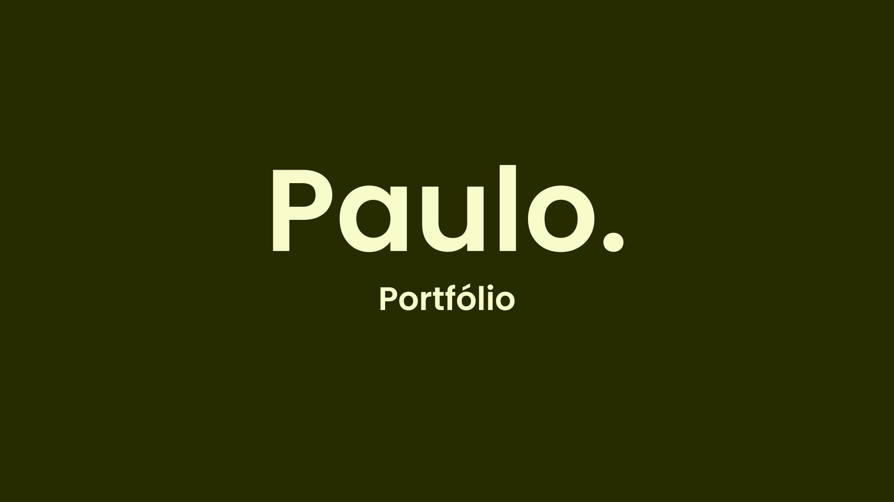

# Portfólio - Paulo Cesar

Portfólio pessoal de Paulo Cesar - Desenvolvedor front-end e estudante de Ciências da Computação.

## LINK DO WEBSITE

https://pauloportf.vercel.app/

## Linguagens

    

